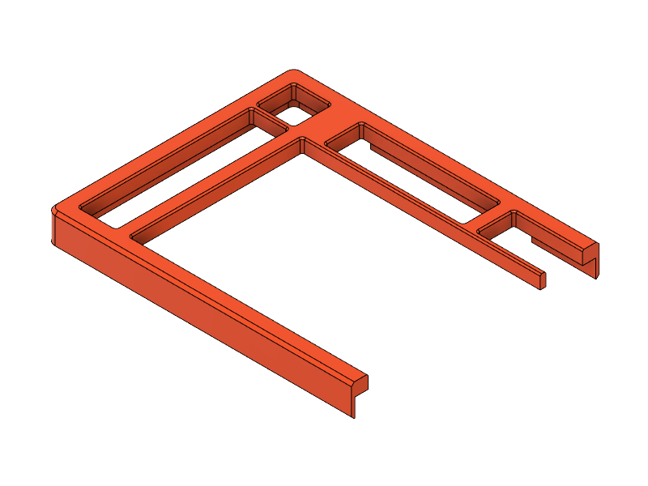

# type1 KBO-5000

## Case Files

<table>
  <thead>
    <tr>
      <th>L/R</th>
      <th>RShift</th>
      <th>Blocker</th>
      <th>Top</th>
      <th>Bottom</th>
    </tr>
  </thead>
  <tbody>
    <tr>
      <td rowspan="5" align="center">L</td>
      <td align="center">–</td>
      <td align="center">–</td>
      <td>
        
         
        <a href="top/t1k-top-L.stl">t1k-top-L.stl</a>
         
        <a href="top/t1k-top-L--hsi.stl">t1k-top-L--hsi.stl</a> [H]
      </td>
      <td rowspan="5">
        
         
        <a href="bottom/t1k-bot-L.stl">t1k-bot-L.stl</a>
         
        <a href="bottom/t1k-m-bot-L.stl">t1k-m-bot-L.stl</a> [M]
          
        
         
        <a href="bottom/t1k-bot-L--v.stl">t1k-bot-L--v.stl</a>
         
        <a href="bottom/t1k-m-bot-L--v.stl">t1k-m-bot-L--v.stl</a
        > [M]
      </td>
    </tr>
    <tr></tr>
    <tr>
      <td align="center">–</td>
      <td align="center">B1</td>
      <td>
        
         
        <a href="top/t1k-top-L_B1.stl">t1k-top-L_B1.stl</a>
         
        <a href="top/t1k-top-L_B1--hsi.stl">t1k-top-L_B1--hsi.stl</a
        > [H]
      </td>
    </tr>
    <tr></tr>
    <tr>
      <td align="center">–</td>
      <td align="center">B2</td>
      <td>
        
         
        <a href="top/t1k-top-L_B2.stl">t1k-top-L_B2.stl</a>
         
        <a href="top/t1k-top-L_B2--hsi.stl">t1k-top-L_B2--hsi.stl</a
        > [H]
      </td>
    </tr>
    <tr>
      <td></td>
      <td></td>
      <td></td>
      <td></td>
      <td></td>
    </tr>
    <tr>
      <td rowspan="11" align="center">R</td>
      <td align="center">1.75</td>
      <td align="center">–</td>
      <td>
        
         
        <a href="top/t1k-top-R_1.75s.stl">t1k-top-R_1.75s.stl</a>
         
        <a href="top/t1k-top-R_1.75s--hsi.stl">t1k-top-R_1.75s--hsi.stl</a
        > [H]
      </td>
      <td rowspan="11">
        
         
        <a href="bottom/t1k-bot-R.stl">t1k-bot-R.stl</a>
         
        <a href="bottom/t1k-m-bot-R.stl">t1k-m-bot-R.stl</a> [M]
          
        
         
        <a href="bottom/t1k-bot-R--v.stl">t1k-bot-R--v.stl</a>
         
        <a href="bottom/t1k-m-bot-R--v.stl">t1k-m-bot-R--v.stl</a
        > [M]
      </td>
    </tr>
    <tr></tr>
    <tr>
      <td align="center">1.75</td>
      <td align="center">B1</td>
      <td>
         
        <a href="top/t1k-top-R_1.75s_B1.stl">t1k-top-R_1.75s_B1.stl</a>
         
        <a href="top/t1k-top-R_1.75s_B1--hsi.stl">t1k-top-R_1.75s_B1--hsi.stl</a
        > [H]
      </td>
    </tr>
    <tr></tr>
    <tr>
      <td align="center">1.75</td>
      <td align="center">B2</td>
      <td>
         
        <a href="top/t1k-top-R_1.75s_B2.stl">t1k-top-R_1.75s_B2.stl</a>
         
        <a href="top/t1k-top-R_1.75s_B2--hsi.stl">t1k-top-R_1.75s_B2--hsi.stl</a
        > [H]
      </td>
    </tr>
    <tr></tr>
    <tr>
      <td align="center">2.75</td>
      <td align="center">–</td>
      <td>
         
        <a href="top/t1k-top-R_2.75s.stl">t1k-top-R_2.75s.stl</a>
         
        <a href="top/t1k-top-R_2.75s--hsi.stl">t1k-top-R_2.75s--hsi.stl</a
        > [H]
      </td>
    </tr>
    <tr></tr>
    <tr>
      <td align="center">2.75</td>
      <td align="center">B1</td>
      <td>
         
        <a href="top/t1k-top-R_2.75s_B1.stl">t1k-top-R_2.75s_B1.stl</a>
         
        <a href="top/t1k-top-R_2.75s_B1--hsi.stl">t1k-top-R_2.75s_B1--hsi.stl</a
        > [H]
      </td>
    </tr>
    <tr></tr>
    <tr>
      <td align="center">2.75</td>
      <td align="center">B2</td>
      <td>
         
        <a href="top/t1k-top-R_2.75s_B2.stl">t1k-top-R_2.75s_B2.stl</a>
         
        <a href="top/t1k-top-R_2.75s_B2--hsi.stl">t1k-top-R_2.75s_B2--hsi.stl</a
        > [H]
      </td>
    </tr>
  </tbody>
</table>

&nbsp;&nbsp;&nbsp;&nbsp;[H] Heat Set Inserts: Max-height: 5mm, Hole Diameter: 3.2mm
 
&nbsp;&nbsp;&nbsp;&nbsp;[M] <a href="../../mounting/">Mounting compatible</a>
