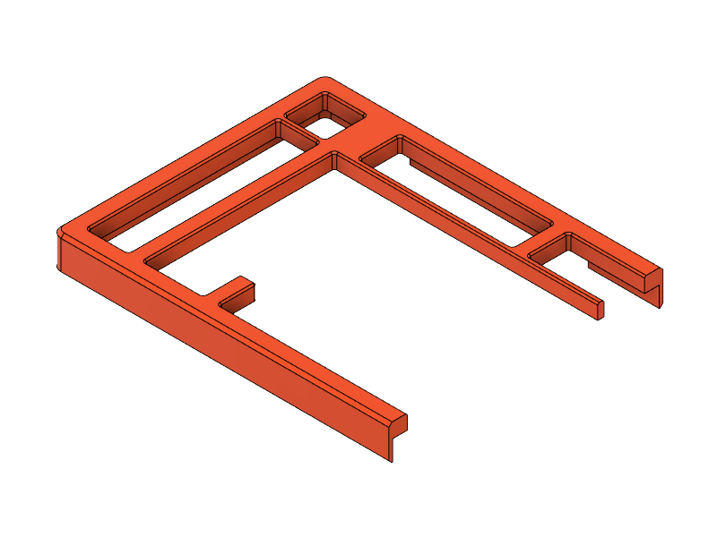
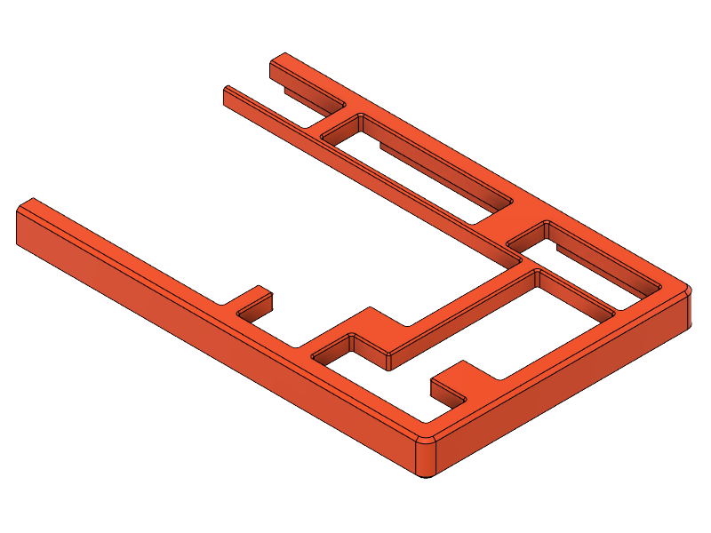
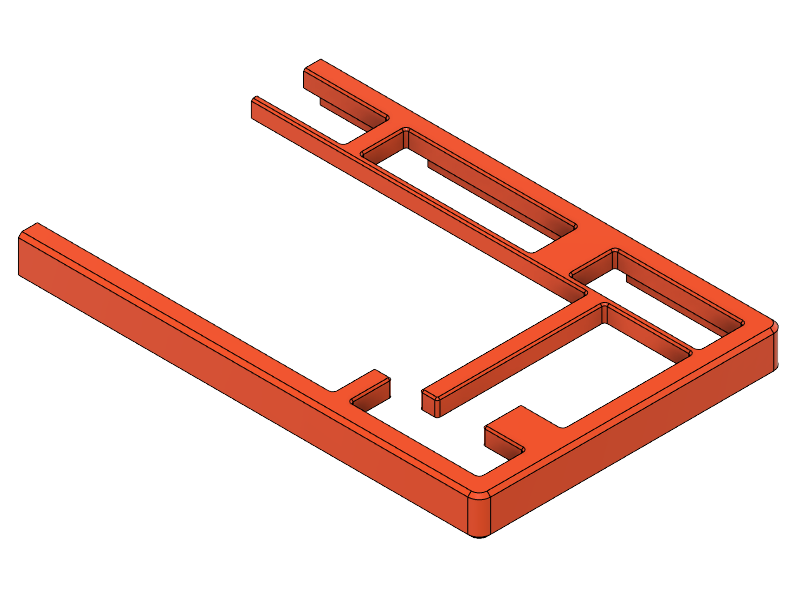
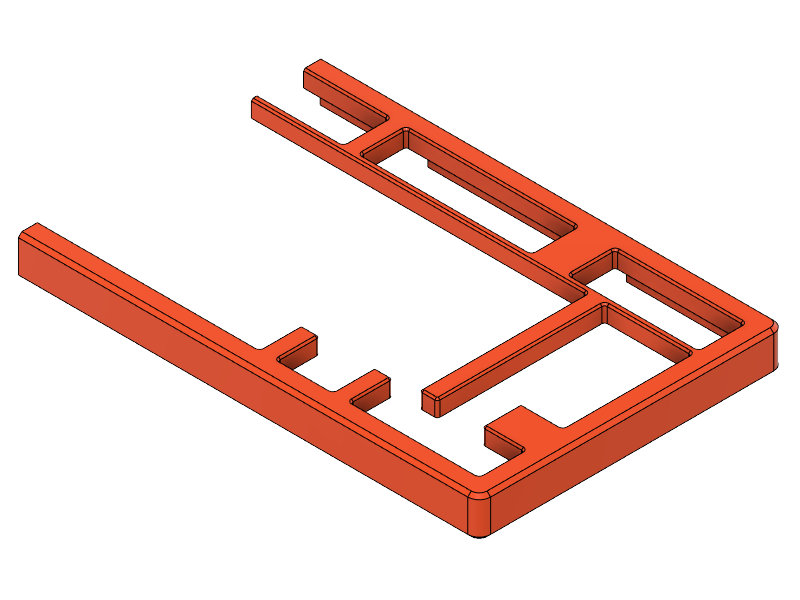
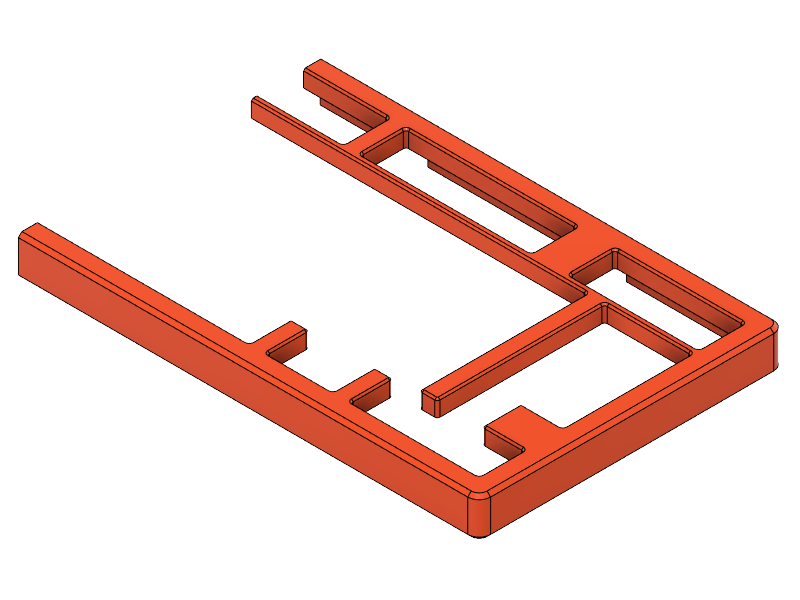

# type1 KBO-5000

## Heat-Set Insert Tops

<table>
  <thead>
    <tr>
      <th>L/R</th>
      <th></th>
      <th>R-Shift</th>
      <th>Blocker</th>
      <th>Top (Heat-Set Insert)*</th>
    </tr>
  </thead>
  <tbody>
    <tr>
      <td rowspan="5" style="text-align: center;">L</td>
      <td></td>
      <td style="text-align: center;">–</td>
      <td style="text-align: center;">–</td>
      <td><a href="t1k-top-L--hsi.stl">t1k-top-L--hsi.stl</a></td>
    </tr>
    <tr></tr>
    <tr>
      <td></td>
      <td style="text-align: center;">–</td>
      <td style="text-align: center;">B1</td>
      <td><a href="t1k-top-L_B1--hsi.stl">t1k-top-L_B1--hsi.stl</a></td>
    </tr>
    <tr></tr>
    <tr>
      <td></td>
      <td style="text-align: center;">–</td>
      <td style="text-align: center;">B2</td>
      <td><a href="t1k-top-L_B2--hsi.stl">t1k-top-L_B2--hsi.stl</a></td>
    </tr>
    <tr>
      <td></td>
      <td></td>
      <td></td>
      <td></td>
      <td></td>
    </tr>
    <tr>
      <td rowspan="11" style="text-align: center;">R</td>
      <td></td>
      <td style="text-align: center;">1.75</td>
      <td style="text-align: center;">–</td>
      <td><a href="t1k-top-R_1.75s--hsi.stl">t1k-top-R_1.75s--hsi.stl</a></td>
    </tr>
    <tr></tr>
    <tr>
      <td></td>
      <td style="text-align: center;">1.75</td>
      <td style="text-align: center;">B1</td>
      <td><a href="t1k-top-R_1.75s_B1--hsi.stl">t1k-top-R_1.75s_B1--hsi.stl</a></td>
    </tr>
    <tr></tr>
    <tr>
      <td></td>
      <td style="text-align: center;">1.75</td>
      <td style="text-align: center;">B2</td>
      <td><a href="t1k-top-R_1.75s_B2--hsi.stl">t1k-top-R_1.75s_B2--hsi.stl</a></td>
    </tr>
    <tr></tr>
    <tr>
      <td></td>
      <td style="text-align: center;">2.75</td>
      <td style="text-align: center;">–</td>
      <td><a href="t1k-top-R_2.75s--hsi.stl">t1k-top-R_2.75s--hsi.stl</a></td>
    </tr>
    <tr></tr>
    <tr>
      <td></td>
      <td style="text-align: center;">2.75</td>
      <td style="text-align: center;">B1</td>
      <td><a href="t1k-top-R_2.75s_B1--hsi.stl">t1k-top-R_2.75s_B1--hsi.stl</a></td>
    </tr>
    <tr></tr>
    <tr>
      <td></td>
      <td style="text-align: center;">2.75</td>
      <td style="text-align: center;">B2</td>
      <td><a href="t1k-top-R_2.75s_B2--hsi.stl">t1k-top-R_2.75s_B2--hsi.stl</a></td>
    </tr>
  </tbody>
</table>

&nbsp;&nbsp;&nbsp;&nbsp;\* Inserts: Max-height: 5mm, Hole Diameter: 3.2mm
