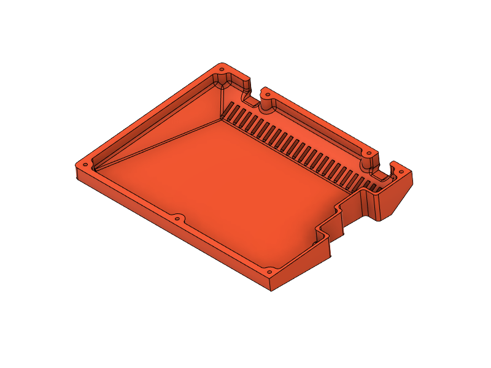
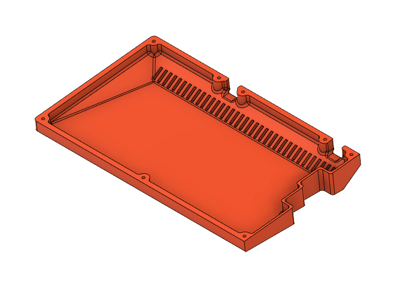
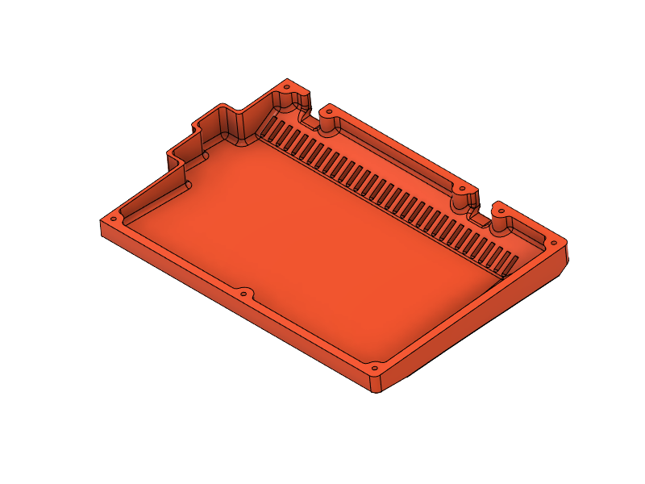
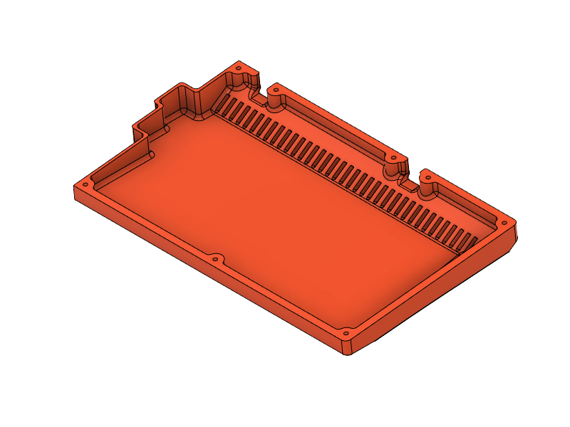

# type1 Quefrency

## Case Files

<table>
  <thead>
    <tr>
      <th>L/R</th>
      <th>Size</th>
      <th>Top</th>
      <th colspan="2">Bottom</th>
    </tr>
  </thead>
  <tbody>
    <tr>
      <td style="text-align: center" rowspan="3">L</td>
      <td style="text-align: center"><s>M</s></td>
      <td>
        
         
        <a href="top/t1q-top-L.stl">t1q-top-L.stl</a>
         
        <a href="top/t1q-top-L--hsi.stl">t1q-top-L--hsi.stl&dagger;</a>
      </td>
      <td>
        
         
        <a href="bottom/t1q-bot-L.stl">t1q-bot-L.stl</a>
      </td>
      <td>
        
         
        <a href="bottom/t1q-bot-L--v.stl">t1q-bot-L--v.stl</a>
      </td>
    </tr>
    <tr></tr>
    <tr>
      <td style="text-align: center">M</td>
      <td>
        
         
        <a href="top/t1q-top-L_M.stl">t1q-top-L_M.stl</a>
         
        <a href="top/t1q-top-L_M--hsi.stl">t1q-top-L_M--hsi.stl&dagger;</a>
      </td>
      <td>
        
         
        <a href="bottom/t1q-bot-L_M.stl">t1q-bot-L_M.stl</a>
      </td>
      <td>
         <a
          href="bottom/t1q-bot-L_M--v.stl"
          >t1q-bot-L_M--v.stl</a
        >
      </td>
    </tr>
    <tr>
      <td></td>
      <td></td>
      <td></td>
      <td></td>
      <td></td>
    </tr>
    <tr>
      <td style="text-align: center" rowspan="5">R</td>
      <td style="text-align: center">60</td>
      <td>
        
         
        <a href="top/t1q-top-R_60.stl">t1q-top-R_60.stl</a>
         
        <a href="top/t1q-top-R_60--hsi.stl">t1q-top-R_60--hsi.stl&dagger;</a>
      </td>
      <td>
        
         
        <a href="bottom/t1q-bot-R_60.stl">t1q-bot-R_60.stl</a>
      </td>
      <td>
        
         
        <a href="bottom/t1q-bot-R_60--v.stl">t1q-bot-R_60--v.stl</a>
      </td>
    </tr>
    <tr></tr>
    <tr>
      <td style="text-align: center" rowspan="3">65</td>
      <td>
        
         
        <a href="top/t1q-top-R_65.stl">t1q-top-R_65.stl</a>
         
        <a href="top/t1q-top-R_65--hsi.stl">t1q-top-R_65--hsi.stl&dagger;</a>
      </td>
      <td rowspan="3">
        
         
        <a href="bottom/t1q-bot-R_65.stl">t1q-bot-R_65.stl</a>
      </td>
      <td rowspan="3">
        
         
        <a href="bottom/t1q-bot-R_65--v.stl">t1q-bot-R_65--v.stl</a>
      </td>
    </tr>
    <tr></tr>
    <tr>
      <td>
        
         
        <a href="top/t1q-top-R_65_B.stl">t1q-top-R_65_B.stl</a>
         
        <a href="top/t1q-top-R_65_B--hsi.stl">t1q-top-R_65_B--hsi.stl&dagger;</a>
      </td>
    </tr>
  </tbody>
</table>

&nbsp;&nbsp;&nbsp;&nbsp;&dagger; Heat Set Inserts: Max-height: 5mm, Hole Diameter: 3.2mm