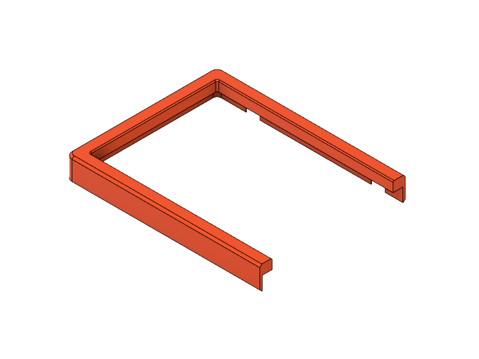
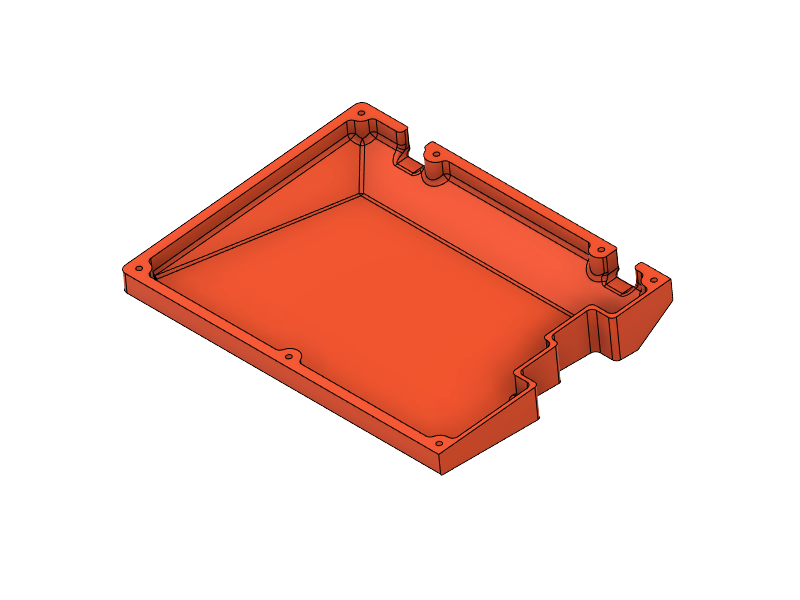
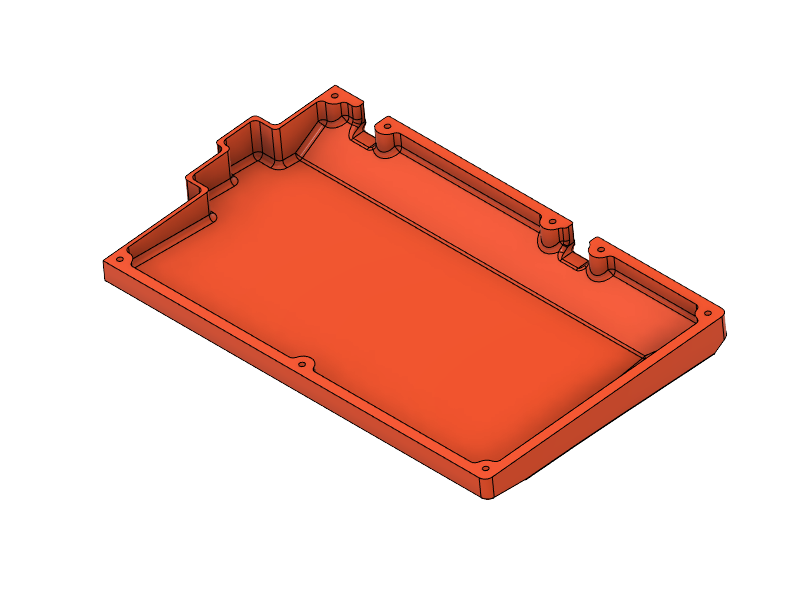

# type1 Quefrency

## Case Files

<table>
  <thead>
    <tr>
      <th>L/R</th>
      <th>Size</th>
      <th></th>
      <th>Top (Screw-in)</th>
      <th>Top (Heat-Set Insert)*</th>
      <th></th>
      <th>Bottom</th>
      <th>Vented</th>
    </tr>
  </thead>
  <tbody>
    <tr>
      <td style="text-align: center;" rowspan="3">L</td>
      <td style="text-align: center;"><s>M</s></td>
      <td></td>
      <td><a href="t1q-top-L.stl">t1q-top-L.stl</a></td>
      <td><a href="heat-set-insert/t1q-top-L--hsi.stl">t1q-top-L--hsi.stl</a></td>
      <td></td>
      <td><a href="t1q-bot-L.stl">t1q-bot-L.stl</a></td>
      <td><a href="vented/t1q-bot-L--v.stl">t1q-bot-L--v.stl</a></td>
    </tr>
    <tr></tr>
    <tr>
      <td style="text-align: center;">M</td>
      <td></td>
      <td><a href="t1q-top-L_M.stl">t1q-top-L_M.stl</a></td>
      <td><a href="heat-set-insert/t1q-top-L_M--hsi.stl">t1q-top-L_M--hsi.stl</a></td>
      <td></td>
      <td><a href="t1q-bot-L_M.stl">t1q-bot-L_M.stl</a></td>
      <td><a href="vented/t1q-bot-L_M--v.stl">t1q-bot-L_M--v.stl</a></td>
    </tr>
    <tr>
      <td></td>
      <td></td>
      <td></td>
      <td></td>
      <td></td>
      <td></td>
      <td></td>
      <td></td>
    </tr>
    <tr>
      <td style="text-align: center;" rowspan="5">R</td>
      <td style="text-align: center;">60</td>
      <td></td>
      <td><a href="t1q-top-R_60.stl">t1q-top-R_60.stl</a></td>
      <td><a href="heat-set-insert/t1q-top-R_60--hsi.stl">t1q-top-R_60--hsi.stl</a></td>
      <td></td>
      <td><a href="t1q-bot-R_60.stl">t1q-bot-R_60.stl</a></td>
      <td><a href="vented/t1q-bot-R_60--v.stl">t1q-bot-R_60--v.stl</a></td>
    </tr>
    <tr></tr>
    <tr>
      <td style="text-align: center;" rowspan="3">65</td>
      <td></td>
      <td><a href="t1q-top-R_65.stl">t1q-top-R_65.stl</a></td>
      <td><a href="heat-set-insert/t1q-top-R_65--hsi.stl">t1q-top-R_65--hsi.stl</a></td>
      <td rowspan="3"></td>
      <td rowspan="3"><a href="t1q-bot-R_65.stl">t1q-bot-R_65.stl</a></td>
      <td rowspan="3"><a href="vented/t1q-bot-R_65--v.stl">t1q-bot-R_65--v.stl</a></td>
    </tr>
    <tr></tr>
    <tr>
      <td></td>
      <td><a href="t1q-top-R_65_B.stl">t1q-top-R_65_B.stl</a></td>
      <td><a href="heat-set-insert/t1q-top-R_65_B--hsi.stl">t1q-top-R_65_B--hsi.stl</a></td>
    </tr>
  </tbody>
</table>

&nbsp;&nbsp;&nbsp;&nbsp;\* Inserts: Max-height: 5mm, Hole Diameter: 3.2mm
