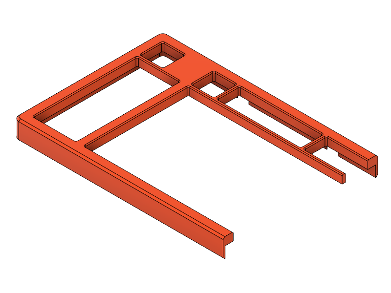

# type1 Sinc

## Heat-Set Insert Tops

<table>
  <thead>
    <tr>
      <th>L/R</th>
      <th>Size</th>
      <th></th>
      <th>Top (Heat-Set Insert)*</th>
    </tr>
  </thead>
  <tbody>
    <tr>
      <td style="text-align: center;" rowspan="3">L</td>
      <td style="text-align: center;"><s>M</s></td>
      <td></td>
      <td><a href="t1s-top-L--hsi.stl">t1s-top-L--hsi.stl</a></td>
    </tr>
    <tr></tr>
    <tr>
      <td style="text-align: center;">M</td>
      <td></td>
      <td><a href="t1s-top-L_M--hsi.stl">t1s-top-L_M--hsi.stl</a></td>
    </tr>
    <tr>
      <td></td>
      <td></td>
      <td></td>
      <td></td>
    </tr>
    <tr>
      <td style="text-align: center;" rowspan="3">R</td>
      <td style="text-align: center;">75</td>
      <td></td>
      <td><a href="t1s-top-R--hsi.stl">t1s-top-R--hsi.stl</a></td>
    </tr>
    <tr></tr>
    <tr>
      <td style="text-align: center;">75+B</td>
      <td></td>
      <td><a href="t1s-top-R_B--hsi.stl">t1s-top-R_B--hsi.stl</a></td>
    </tr>
  </tbody>
</table>

&nbsp;&nbsp;&nbsp;&nbsp;\* Inserts: Max-height: 5mm, Hole Diameter: 3.2mm
