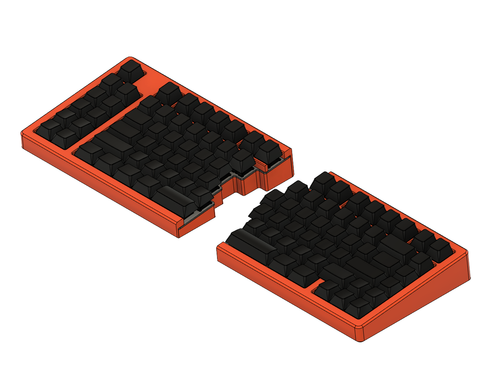

# type2

<table>
  <tbody>
    <tr style="text-align: center">
      <td style="width: 33%">
        <a href="quefrency">
          
          Quefrency
        </a>
      </td>
      <td style="width: 33%">
        <a href="sinc">
          
          Sinc
        </a>
      </td>
      <td style="width: 33%">
        <a href="kbo-5000">
          
          KBO-5000
        </a>
      </td>
    </tr>
  </tbody>
</table>
