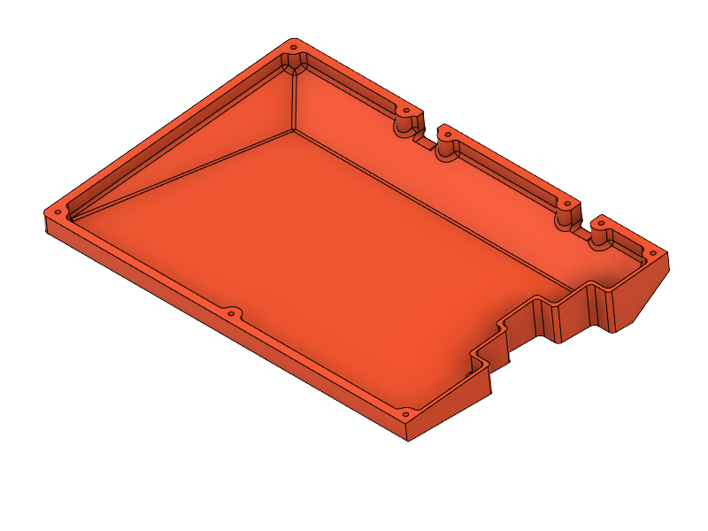

# type3 Sinc

## Case Files

<table>
  <thead>
    <tr>
      <th>L/R</th>
      <th>Size</th>
      <th>Top</th>
      <th colspan="2">Bottom</th>
    </tr>
  </thead>
  <tbody>
    <tr>
      <td align="center" rowspan="3">L</td>
      <td align="center"><s>M</s></td>
      <td width="33.3%">
        
         
        <a href="top/t3s-top-L.stl">t3s-top-L.stl</a>
         
        <a href="top/t3s-top-L--hsi.stl">t3s-top-L--hsi.stl</a> [H]
      </td>
      <td width="33.3%">
        
         
        <a href="bottom/t3s-bot-L.stl">t3s-bot-L.stl</a>
         
        <a href="bottom/t3s-m-bot-L.stl">t3s-m-bot-L.stl</a> [M]
      </td>
      <td width="33.3%">
        
         
        <a href="bottom/t3s-bot-L--v.stl">t3s-bot-L--v.stl</a>
         
        <a href="bottom/t3s-m-bot-L--v.stl">t3s-m-bot-L--v.stl</a> [M]
      </td>
    </tr>
    <tr></tr>
    <tr>
      <td align="center">M</td>
      <td>
        
         
        <a href="top/t3s-top-L_M.stl">t3s-top-L_M.stl</a>
         
        <a href="top/t3s-top-L_M--hsi.stl">t3s-top-L_M--hsi.stl</a> [H]
      </td>
      <td>
        
         
        <a href="bottom/t3s-bot-L_M.stl">t3s-bot-L_M.stl</a>
         
        <a href="bottom/t3s-m-bot-L_M.stl">t3s-m-bot-L_M.stl</a> [M]
      </td>
      <td>
        
         
        <a href="bottom/t3s-bot-L_M--v.stl">t3s-bot-L_M--v.stl</a>
         
        <a href="bottom/t3s-m-bot-L_M--v.stl">t3s-m-bot-L_M--v.stl</a> [M]
      </td>
    </tr>
    <tr></tr>
    <tr>
      <td align="center" rowspan="3">R</td>
      <td align="center">75</td>
      <td>
        
         
        <a href="top/t3s-top-R.stl">t3s-top-R.stl</a>
         
        <a href="top/t3s-top-R--hsi.stl">t3s-top-R--hsi.stl</a> [H]
      </td>
      <td rowspan="3">
        
         
        <a href="bottom/t3s-bot-R.stl">t3s-bot-R.stl</a>
         
        <a href="bottom/t3s-m-bot-R.stl">t3s-m-bot-R.stl</a> [M]
      </td>
      <td rowspan="3">
        
         
        <a href="bottom/t3s-bot-R--v.stl">t3s-bot-R--v.stl</a>
         
        <a href="bottom/t3s-m-bot-R--v.stl">t3s-m-bot-R--v.stl</a> [M]
      </td>
    </tr>
    <tr></tr>
    <tr>
      <td align="center">75+B</td>
      <td>
        
         
        <a href="top/t3s-top-R_B.stl">t3s-top-R_B.stl</a>
         
        <a href="top/t3s-top-R_B--hsi.stl">t3s-top-R_B--hsi.stl</a> [H]
      </td>
    </tr>
  </tbody>
</table>

&nbsp;&nbsp;&nbsp;&nbsp;[H] Heat Set Inserts: Max-height: 5mm, Hole Diameter: 3.2mm
 
&nbsp;&nbsp;&nbsp;&nbsp;[M] <a href="../../mounting/">Mounting compatible</a>
